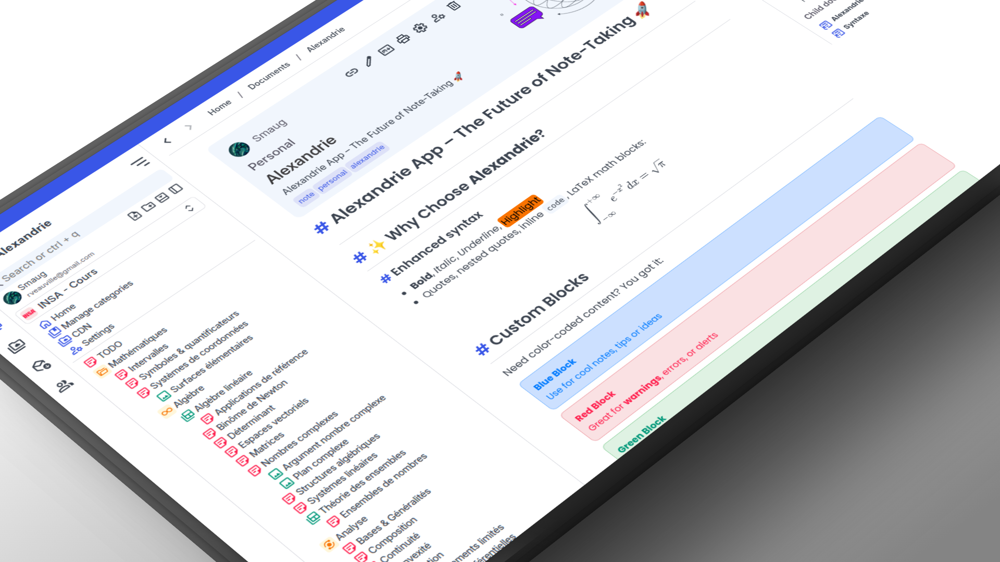
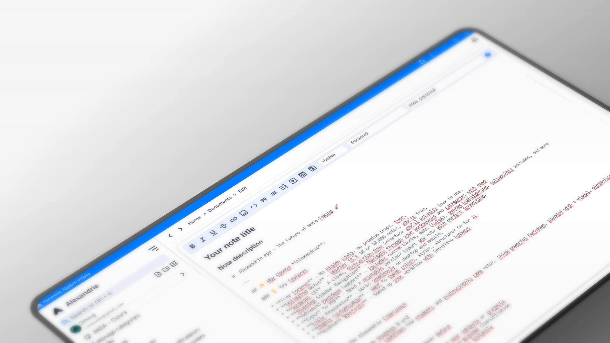
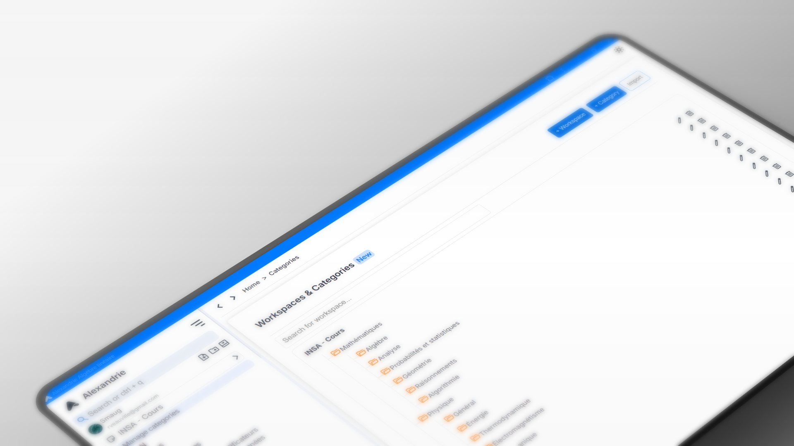

# Alexandrie – The Ultimate Note-Taking App


<b>A modern and elegant application for taking notes in extended Markdown.</b><br>
Organize, search, and export your notes with an intuitive interface designed for students and productivity.

<p align="center">

[](https://github.com/Smaug6739/Alexandrie/stargazers)
[](https://github.com/Smaug6739/Alexandrie/issues)
[](https://github.com/Smaug6739/Alexandrie/blob/main/LICENSE)
[](https://github.com/Smaug6739/Alexandrie/pulls)
[](https://github.com/Smaug6739/Alexandrie/releases)
[](<[https://github.com/Smaug6739/Alexandrie/pulls](https://discord.gg/UPsEg6egPj)>)

</p>



## ✨ Features

- **Enhanced Markdown Editor** – Write notes with advanced and unique Markdown features.
- **Instant Search** – Find your notes in seconds.
- **Intuitive Organization** – Easily categorize and archive your notes with a complete sidebar, workspaces, categories, nested documents / categories, tags...
- **Export & Print** – Save your notes as PDF, Markdown, and more.
- **Access Anywhere** – Log in and retrieve your notes from any device. Use the PWA to access your notes offline.
- **Share Notes** – Share your notes with others via unique links or powerful permissions system.

---

## Interface Preview



### Share your notes, collaborate with others, manage permissions.



## Quick Start with Docker

For local testing and development, you can use Docker to run the entire stack:

**Start a demo server:**

- Download the [docker-compose.yml](./docker-compose.yml) file.
- Download the [.env.example](./.env.example) file and rename it to `.env`, then adjust any environment variables as needed. _Default settings should work out of the box._

```bash
docker compose up
```

**Start a development server with hot reloading (HMR, and need to clone the repo):**

```bash
docker compose -f docker-compose.yml -f docker-compose.dev.yml up --build
```

For complete setup instructions, please refer to the [Setup Documentation](./docs/README.md).

**Access points:**

- **Frontend**: http://localhost:8200
- **Backend API**: http://localhost:8201
- **Object Storage Console**: http://localhost:9000
- **MySQL**: localhost:3307 (user: `alexandrie`, password: `password`)

**To stop:**

```bash
docker compose down
```

_The project support S3 compatible storage. The default in docker-compose is RustFS but you can use MinIO, garage, etc._

If you don't have Docker installed, you can follow the manual setup instructions in the [CONTRIBUTING.md](./CONTRIBUTING.md).

## Contributing

This project has an MIT license. And you are welcome to contribute.
For more details on contributions, please read the [CONTRIBUTING.md](./CONTRIBUTING.md) file.

> Thank you to everyone who contributes to the project. 🎉
