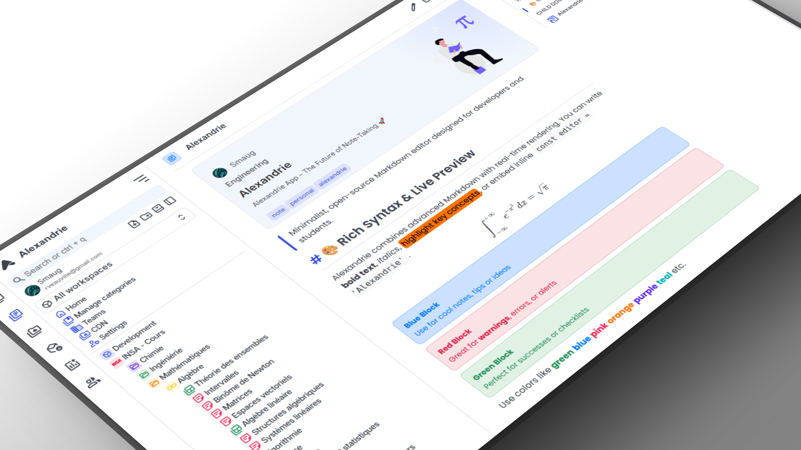
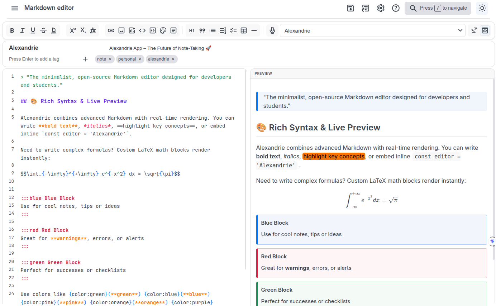
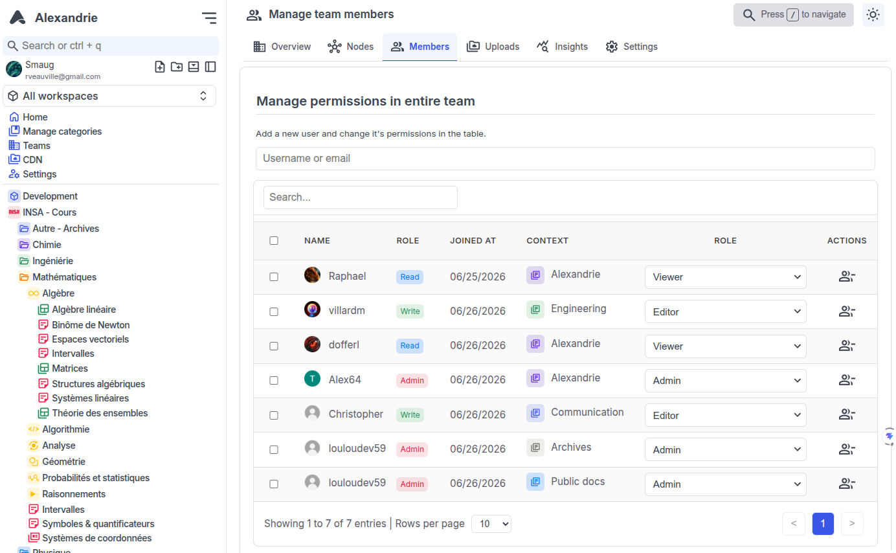
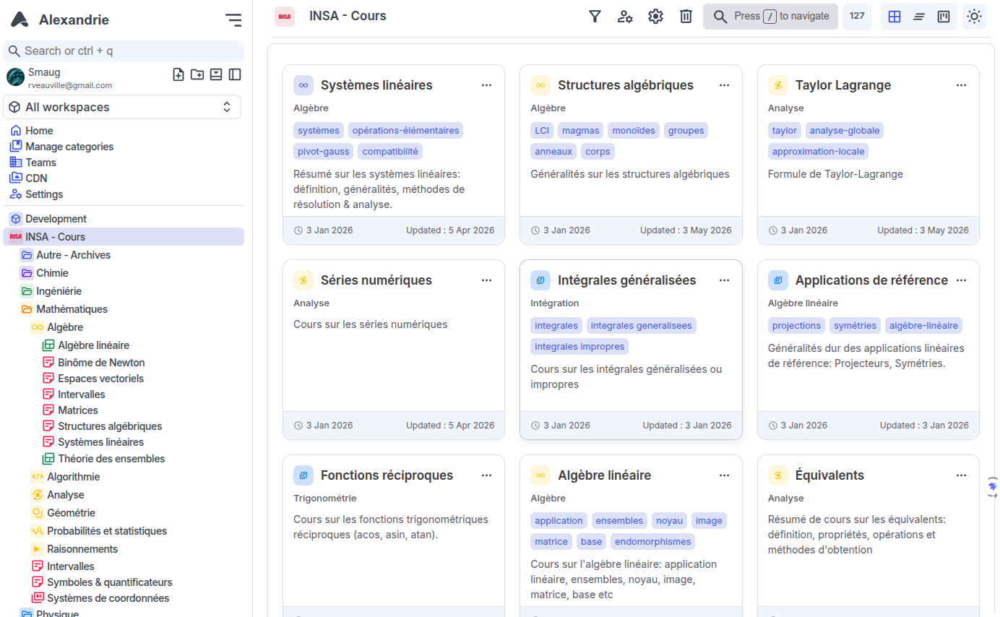
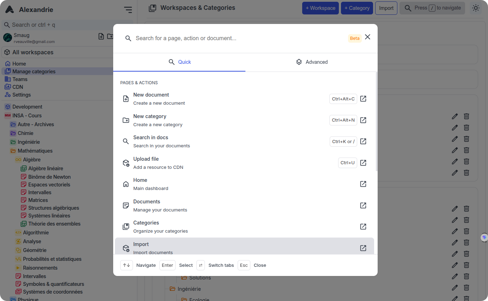
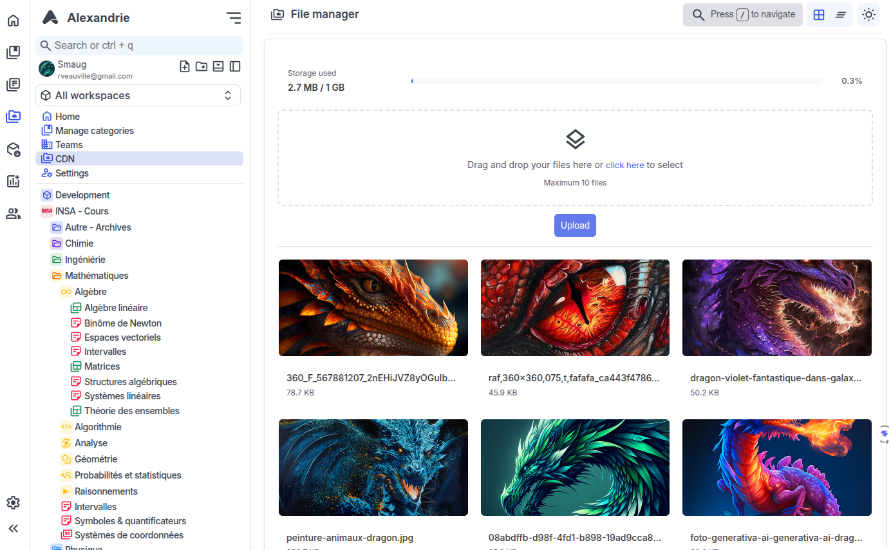

<div align="center">


# Alexandrie

**A self-hosted, open-source knowledge base with an extended Markdown editor.**<br>
Organize, search, share and export your notes from any device, even offline.



[](https://github.com/Smaug6739/Alexandrie/stargazers)
[](https://github.com/Smaug6739/Alexandrie/releases)
[](https://github.com/Smaug6739/Alexandrie/blob/main/LICENSE)
[](https://discord.gg/UPsEg6egPj)

</div>

## Why Alexandrie?

Alexandrie is an open-source self-hosted wiki and knowledge management platform built for teams and individuals. It combines a powerful Markdown editor, offline support, collaboration tools, and enterprise-grade permissions, making it an alternative to Notion, Confluence and Obsidian.

- **One-Command Deployment:** Bring up the entire full-stack application instantly using Docker.
- **Advanced Markdown Engine:** Native support for LaTeX, custom containers, interactive checkboxes, frames, snippets, and integrated diagram building.
- **Granular Organization:** Multi-tenant architecture supporting Teams, Workspaces, Categories, and nested Documents.
- **Offline-First PWA:** Install on any desktop or mobile device with full offline capabilities and seamless synchronization.
- **Production Ready:** Built-in OpenID Connect (OIDC) SSO providers, automated full-system backup/restore pipelines, and a robust media storage architecture.

## Core Features

### Advanced Writing & Rich Markdown

Alexandrie features an extended CodeMirror 6 environment tailored for technical writing. It handles complex academic blocks, custom styles, global theme alignment, and real-time scroll synchronization seamlessly.



- Speech-to-Text: Dictate notes directly into your editor using integrated voice-recognition APIs.

- Native Diagrams: Create, edit, and render flowcharts or structural diagrams right inside your Markdown flow.

- Snippet Manager: Save, reuse, and import/export frequently used templates or code fragments.

### Team Workspaces & Access Control

Manage multi-user environments with clear hierarchy and strict isolation. Securely share knowledge across organizations through unique public links or granular group rules.



- 5-Level Access Model: Fine-tune user privileges from None, Read, Write, Admin, to Owner status per node or workspace.

- Enterprise Operations: Generate temporary invitation codes, configure custom scopes, and track team allocation tables instantly.

### Navigation & Discovery

Locate documents across complex hierarchies effortlessly with deep structural layouts and high-speed searching tools.



- Command Center (Ctrl + K): A keyboard-driven global overlay allowing you to navigate the app, execute actions, or trigger contextual operations instantly.

- Full-Text Indexing: Instant lookup with snippet highlights and precise relevancy sorting scores.



- Task Management: Every workspace includes integrated Kanban boards to organize objectives alongside your documentation.

### Sovereign Assets & Storage Pipelines

Maintain total ownership over your binaries, media streams, and backups. Alexandrie relies on decoupled storage engines to preserve performance without external analytics dependencies.



- S3 Integration: Native compatibility with decentralized modern object stores (such as RustFS, Garage, MinIO, or AWS).

- Media Sandbox: In-app PDF view rendering and multi-format previewing for over 30 image, audio, and video formats.

- Data Portability: Comprehensive ZIP import/export tools allow users to backup or restore selective nodes, metadata configurations, or entire platform states in a single action.

## Quick Start

Get your instance running in less than a minute:

```bash
# 1. Download the .env.example and docker-compose.yml files
curl https://raw.githubusercontent.com/Smaug6739/Alexandrie/main/.env.example -O .env.example
curl https://raw.githubusercontent.com/Smaug6739/Alexandrie/main/docker-compose.yml -O docker-compose.yml

# 2. Configure environments
cp .env.example .env

# 3. Launch the stack
docker compose up -d
```

Open http://localhost:8200 to create your primary owner account.

For advanced local development guidelines and technical architecture details, please refer to [CONTRIBUTING.md](./CONTRIBUTING.md).

---

<div align="center">
  <sub>Built with ❤️ by <a href="https://github.com/Smaug6739">Smaug6739</a> and contributors.</sub>
</div>
