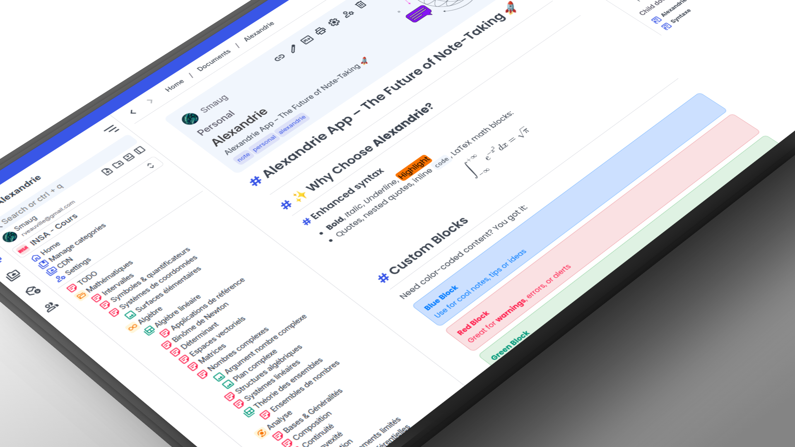
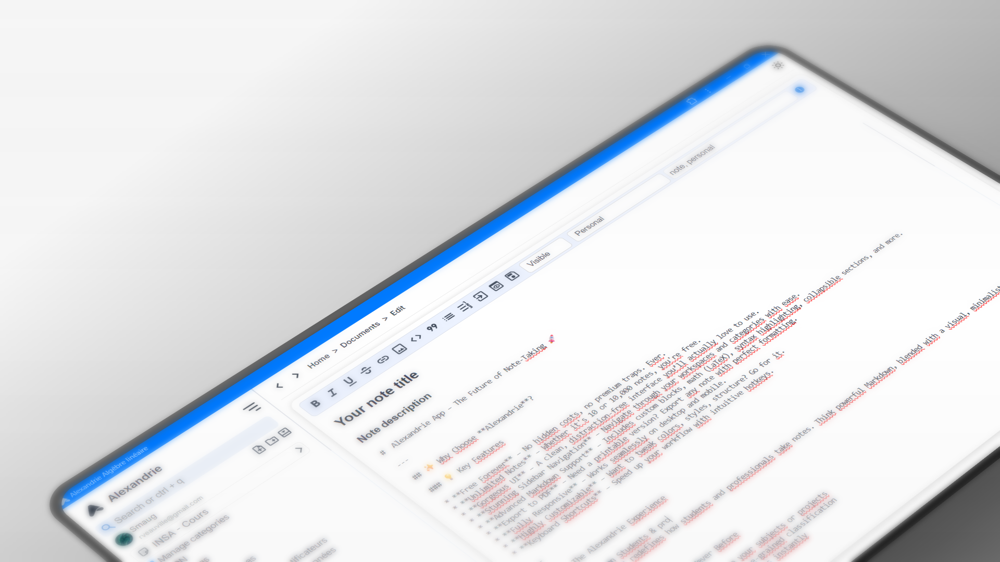
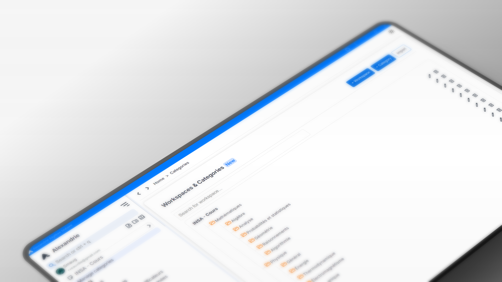

<div align="center">


# Alexandrie

**A self-hosted, open-source knowledge base with an extended Markdown editor.**<br>
Organize, search, share and export your notes — from any device, even offline.

[Live Demo](https://alexandrie-hub.fr) · [Documentation](./docs/README.md) · [Discord](https://discord.gg/UPsEg6egPj)

[](https://github.com/Smaug6739/Alexandrie/stargazers)
[](https://github.com/Smaug6739/Alexandrie/releases)
[](https://github.com/Smaug6739/Alexandrie/blob/main/LICENSE)
[](https://discord.gg/UPsEg6egPj)

</div>



## Why Alexandrie?

Most note-taking apps are either too simple or too bloated. Alexandrie is the sweet spot: a **fast, self-hosted Markdown knowledge base** that's easy to deploy and packed with features you actually need.

- **One command to deploy** — `docker compose up` brings up the full stack 🚀
- **Extended Markdown** — colored containers, academic blocks, KaTeX math, footnotes, interactive checkboxes, and more. Also change preferred theme globally and see all of your notes in a consistent style
- **Full-text search** — instant results with content snippets and relevance ranking
- **Granular permissions** — 5-level access control (None → Read → Write → Admin → Owner) per document, per user
- **PWA & offline support** — install on any device and work without internet
- **SSO / OIDC** — connect Google, GitHub, Microsoft, Discord, or any OpenID provider
- **Workspaces, categories, nested docs** — organize naturally with a tree sidebar, tags, bookmarks, and pinned notes
- **Kanban boards** — plan and organize tasks visually within workspaces
- **Voice-to-text** — dictate notes directly into the editor
- **Backups** — export everything (docs, files, settings) as a ZIP with one click

---

## Screenshots

<details>
<summary><strong>Editor with live preview</strong></summary>



</details>

<details>
<summary><strong>Sharing & permissions</strong></summary>



</details>

<details>
<summary><strong>Mobile view</strong></summary>


</details>

---

## Quick Start

Get Alexandrie running in under a minute:

```bash
# 1. Clone (or just download docker-compose.yml + .env.example)
git clone https://github.com/Smaug6739/Alexandrie.git
cd Alexandrie

# 2. Configure
cp .env.example .env   # defaults work out of the box

# 3. Launch
docker compose up -d
```

Open **http://localhost:8200** and create your account.

> **Dev mode with HMR:**
>
> ```bash
> docker compose -f docker-compose.yml -f docker-compose.dev.yml up --build
> ```

For manual setup without Docker, see [CONTRIBUTING.md](./CONTRIBUTING.md).

---

## Tech Stack

| Layer        | Technology                                     |
| :----------- | :--------------------------------------------- |
| **Frontend** | Nuxt 4 (Vue 3), TypeScript, Pinia, SCSS        |
| **Editor**   | CodeMirror 6 with custom extensions            |
| **Markdown** | markdown-it + custom plugins, KaTeX            |
| **Backend**  | Go (Gin), JWT auth, sqlx                       |
| **Database** | MySQL 8                                        |
| **Storage**  | S3-compatible (RustFS, MinIO, AWS S3, Garage…) |
| **Auth**     | JWT + OIDC / SSO                               |
| **Infra**    | Docker Compose (4 services)                    |

---

## Features at a Glance

<table>
<tr>
<td width="50%">

**Editor & Writing**

- CodeMirror 6 with rich toolbar
- Live preview with scroll sync
- Custom containers, academic blocks, cards/panels
- KaTeX math, syntax highlighting, footnotes
- Custom snippets (create, import/export)
- Voice recognition, drag & drop uploads
- Auto-save, word count, spell check

</td>
<td width="50%">

**Organization & Collaboration**

- Workspaces → Categories → Documents (tree)
- Tags, bookmarks, pinned notes, custom icons
- Kanban boards per workspace
- Public sharing with unique links
- Per-user, per-node permission system
- Full-text search with `Ctrl+K` command center

</td>
</tr>
<tr>
<td>

**Files & Media**

- S3-based CDN for images, videos, audio, docs
- In-app PDF viewer with zoom modes
- 30+ supported formats (images, video, office…)
- Drag & drop file upload into notes

</td>
<td>

**Customization & Admin**

- Dark / Light mode, glassmorphism UI
- Custom CSS injection (global & per-document)
- Font family, size, line height settings
- Admin panel with user management
- Async backup & restore (ZIP)

</td>
</tr>
</table>

---

## Roadmap

See the [open issues](https://github.com/Smaug6739/Alexandrie/issues) for planned features and known bugs.

---

## Contributing

Alexandrie is MIT-licensed and contributions are welcome!
Please read [CONTRIBUTING.md](./CONTRIBUTING.md) before submitting a pull request.

---

## Support the Project

If Alexandrie is useful to you, consider:

- ⭐ **[Star the repository](https://github.com/Smaug6739/Alexandrie)** — it helps others discover the project
- **[Report issues](https://github.com/Smaug6739/Alexandrie/issues)** — bug reports and feature requests help improve the app
- **[Join the Discord](https://discord.gg/UPsEg6egPj)** — get help, share feedback, or just hang out
- **Spread the word** — share Alexandrie with your friends, on social media, or in your community

---

<div align="center">
  <sub>Built with ❤️ by <a href="https://github.com/Smaug6739">Smaug6739</a> and contributors.</sub>
</div>
