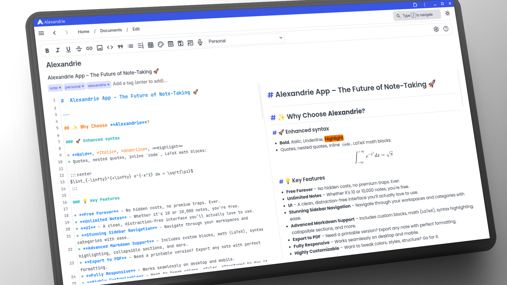
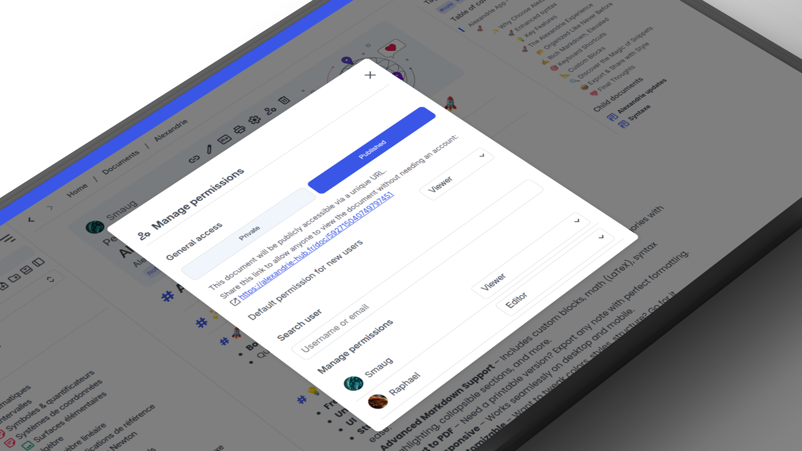

# 📖 Alexandrie – The Ultimate Note-Taking App

<b>A modern and elegant application for taking notes in extended Markdown.</b> 
Organize, search, and export your notes with an intuitive interface designed for students and productivity.

  
  
  

## ✨ Features

✅ **Enhanced Markdown Editor** – Write notes with advanced syntax.  
🔍 **Instant Search** – Find your notes in seconds.  
📁 **Intuitive Organization** – Easily categorize and archive your notes.  
📤 **Export & Print** – Save your notes as PDF, Markdown, and more.  
🌍 **Access Anywhere** – Log in and retrieve your notes from any device.

---

## 🖼️ Interface Preview

### 📁 Organize your notes with categories, tags, sidebar, tree, search, and more.

## Responsive Design

## Contributing 🌍

This project has an MIT license. And you are welcome to contribute.
For more details on contributions, please read the [CONTRIBUTING.md](./CONTRIBUTING.md) file.

> Thank you to everyone who contributes to the project. 🎉
